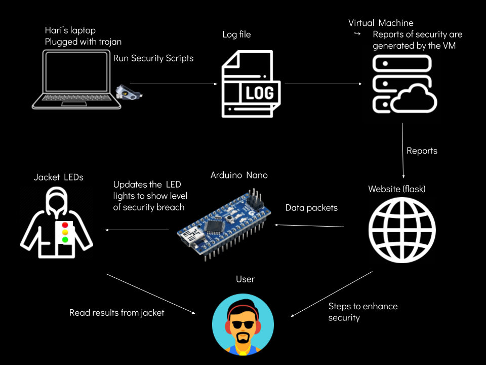

# Cybersecurity Jacket
A jacket for all cyber security enthusiasts!

## Overview
A jacket that shows your security breaches by showing whether it passes our security tests by LED colors (Red - fail, Yellow - semi-vulnerable, Green - pass) and showing solution suggestions on a website. We designed this using a security guard-style jacket and created LED strip designs on the jacket. What makes this unique is that security awareness education does not involve wearable aspects, and is usually information heavy. This is a fun way to learn more about how security breaches and safety.

## Poster

## Materials
- Arduino Nano
- Adafruit Circuit Playground Express
- Virtual Machine
- Dynamic Website
- Security Jacket
- LED strips

## Software Architecture

the security scripts will be run on the demonstrators/a cybersecurity professional’s laptop. A log file is then sent to the virtual machine and the reports of security are generated there. The reports are sent to a web server which will be displayed on a website that shows the solutions specific to the level of security breach. Then data packets are sent to the Arduino Nano. Since the Arduino nano can’t light up the LEDs on its own, the circuit playground express and Arduino nano communicate in order to light up the LED strips on the jacket. The symbols on the jacket are placed to show which LED light represents which security test. The lights are updated to show the level of security breach (red, yellow, green).

